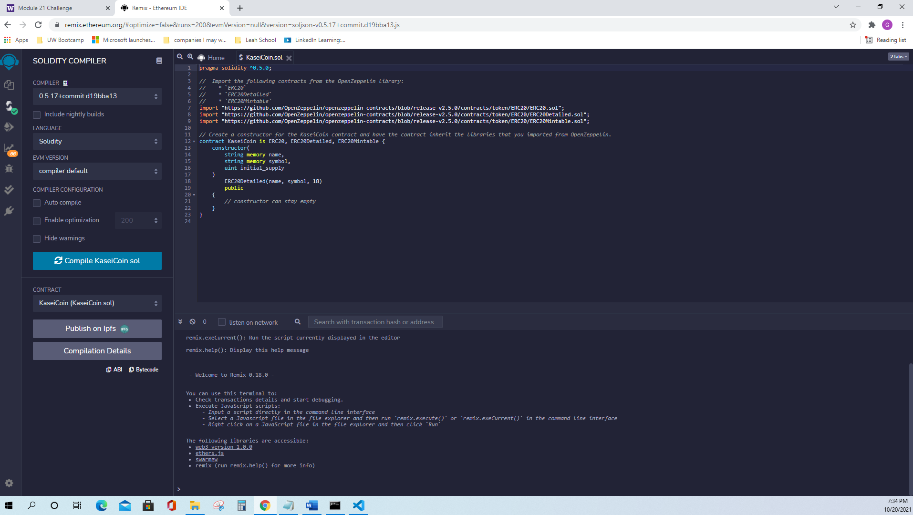
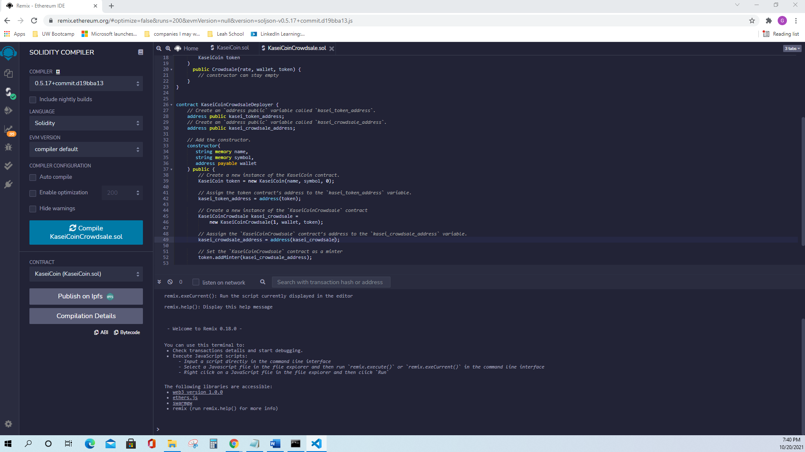

# Challenge21

Fungible Token KaseiCoin

---

## Technologies

This project leverages Python 3.7, OpenZeppelin, Solidity, Crowdsale, and different ERCs.

---

  

Client's address balance and history

  

---

## Contributors

Brought to you by Christine Guo (www.linkedin.com/in/christine-guo)

---

## License

NoNe